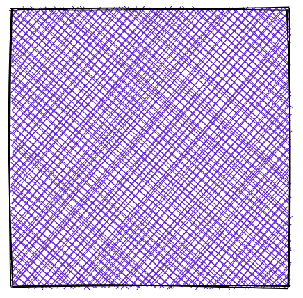

# Rough React Wrapper

<p align="center">
    
</p>

[](https://choosealicense.com/licenses/mit/)
[](https://www.npmjs.com/package/react-rough-wrapper)

This is a React wrapper for [Rough.js](https://roughjs.com/), a JavaScript library for creating sketchy, hand-drawn graphics.

[rough-react-wrapper](https://github.com/fsefidabi/rough-react-wrapper) is an alternative for the archived [react-rough](https://github.com/ooade/react-rough) package published by [ooade](https://github.com/ooade).
The mentioned package has been archived by its owner, and we needed same react wrapper for rough.js drawable objects.
So, I decided to publish another version of this wrapper with more feature supports.

> 🟢 If you are already using the archived [react-rough](https://github.com/ooade/react-rough) package in your projects, you can simply install this new [rough-react-wrapper](https://github.com/fsefidabi/roughjs-react) package,
> and your code will work like a charm! The API is exactly similar, but with some more feature supports: 
> - React 18 support
> - NextJs app router and server side components support


## Installation

You can add rough-react-wrapper to your project via npm.

```
npm install rough-react-wrapper
```


## Usage

To render a rectangle svg in sketchy and hand-drawn style, add these lines into your React component:
```js
import ReactRough, { Rectangle } from 'rough-react-wrapper'

return (
    <ReactRough
        renderer={"svg"}
        width={250}
        height={250}
    >
      <Rectangle
          width={200}
          height={200}
          x={10}
          y={10}
          fill="#6700c9"
          fillStyle={"cross-hatch"}
      />
  </ReactRough>
)
```


It will generate a rectangle shape like this:




## Credits

rough.js react is inspired by these open source projects:

- [roughjs](https://github.com/rough-stuff/rough)
- [react-rough](https://github.com/ooade/react-rough)
- [react-rough-fiber](https://github.com/Bowen7/react-rough-fiber)

## License

[MIT](https://github.com/fsefidabi/rough-react-wrapper/blob/master/LICENSE)
